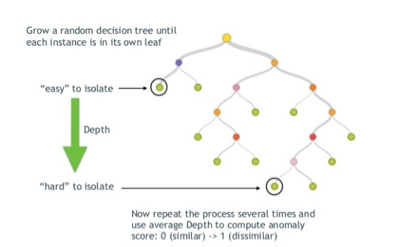
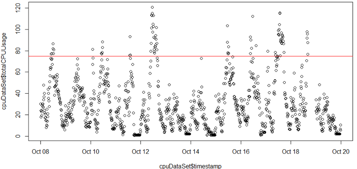

# Machine Learning Experiment

## Friendly Introduction

Machine learning is a part of Artificial intelligent that attempts to apply statistics to identify patterns and give future predictions, having enough historical data.
In this use case we will explore the potential of machine learning within the organisation, attempting to predict a hardware failure. The use case will be focused on KLF server.
Our general goal is to give some short of prediction on downtime. We will use the machine learning workflow to identify the question we are trying to answer, prepare the data, select an algorithm, train our model and finally test its accuracy.


## Documented Options

Firstly, asking the right question is a crucial part, as it will drive all the coming steps.
My first interpretation of the goal was "Will the server fail or not at a given time?". Having such an indication the team can prepare appropriately and be more proactive in managing the workload. Given the recent activity of the server this could be extremely powerful.
Posing the question in that format, transforms the problem to a classification one, returning one out of two values (fail, not failed). As such, algorithms like random tree forest or logistic regression could result in satisfying outputs. In random forest the data is split in subsets and from each subset a tree is made. A tree will measure the relation of the target to the given attributes, where each branch will divide the data accordingly until the target is classified.


Then the final decision, in the random forest is taken by majority.


Although this may be appealing considering the simplification of the problem, the negative (fail) events represent a very small percentage of the set. Therefore the problem may be turned to one that tries to study the exception (failure) rather than the rule. In that case we are looking at Abnormality detection algorithms. If we are looking to classify what is ‘the norm’ using parameters such us CPU usage and I/O, the One Class SVM algorithm could be of interest. Feeding positive data points we could attempt to identify the extreme points that may be able to classify an event as an outlier, as divided by the hyperplane. This translates to identifying what CPU and I/O value are the system limits or 'spikes' (as the question to be studied). Advantages to an SVM approach are its Hight dimensional tolerance, meaning that multiple variables may be used. OCSVM is an unsupervised algorithm, meaning that data is unlabelled (as they are all positive, do not provide further information).


An alternative (also unsupervised) would be isolation forest algorithm. This algorithm is found to have a better performance when benchmarked. It constructs a fully random binary tree by choosing a random attribute j (as the splitting attribute) and a random splitting threshold **θ**. The data is then split accordingly until each point is its own leaf.



From domain knowledge we know that date plays a major role as well. Month end and Mondays for example are most buzzy causing various issues on the server. From an ageing perspective, as the time moves forward new users are added exerting an increasing load, while at the same time the server statistically looses some power according to its specific S.M.A.R.T. values. For this a time series analysis may be preferred. However, this may be too slow for us to analyse, since we will only be looking at data from two years, as part of this first experiment. It may be of something of interest for future analysis, or maybe we could look at using summarised data from more years.

## Working with Data

```r
#...
#see how are data looks:
plot(cpuDataSet$timestamp, cpuDataSet$totalCPUUsage)
#threshold for desired range
abline(h=75, col="red")
```

[Click here](./hardware_failure_analysis.R) to see the full data cleansing code.


